# Questão 1

## Análise Clínica dos Valores

Antes de iniciar o pré-processamento dos dados, é importante entender **quais valores fazem sentido serem 0 ou nulos** no contexto clínico.

| Variável                    | Pode ser zero/nulo? | Justificativa                                                                 |
|-----------------------------|---------------------|-------------------------------------------------------------------------------|
| **Pregnancies**             | ✅ Sim              | Algumas pacientes podem nunca ter engravidado                                 |
| **Glucose**                 | ❌ Não              | Valor 0 indica dado faltante (ninguém vivo tem glicose 0)                     |
| **BloodPressure**           | ❌ Não              | Pressão 0 não é compatível com vida                                           |
| **SkinThickness**           | ❌ Não        | Pode ter valor 0 real, mas geralmente indica valor ausente                   |
| **Insulin**                 | ❌ Não         | 0 pode ser real, mas geralmente representa ausência de medição               |
| **BMI**                     | ❌ Não              | IMC 0 não é possível                                                         |
| **DiabetesPedigreeFunction**| ✅ Sim              | Valor 0 pode significar ausência de histórico familiar                        |
| **Age**                     | ❌ Não              | O dataset é composto por mulheres com mais de 21 anos                        |
| **Outcome**                 | ✅ Sim             | É a variável alvo, precisa estar presente para modelagem                     |

---

Com isso, sabemos quais colunas precisam de **tratamento especial** (substituir os 0s por medianas, por exemplo), pois esses zeros são provavelmente dados faltantes e não valores válidos.

Para identificar se há valores faltantes ou nulos vamos utilizar o seguinte algoritmo

``` python

import pandas as pd
import numpy as np
import matplotlib.pyplot as plt
import seaborn as sns

# Carregar o dataset
df = pd.read_csv("diabetes.csv")

## Verificando por valores faltantes ou nulos
colunas_invalidas = ['Glucose', 'BloodPressure', 'SkinThickness', 'Insulin', 'BMI', 'Age']

for col in colunas_invalidas:
    zeros = (df[col] == 0).sum()
    print(f"{col}: {zeros} valores iguais a 0")

```

com base nisso temos o seguinte output:

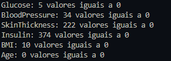

Como temos valores faltantes, o que poderiamos fazer é substituir os valores faltantes com a média ou a mediana dos valores não-nulos

Para realizar a identificação de outliers, poderiamos utilizar boxplot

``` python


'''
1. Existem valores faltantes ou outliers no dataset? Se sim, como você abordaria o
tratamento dessas inconsistências? Explique as técnicas que utilizaria para lidar
com essas questões.
'''

import pandas as pd
import numpy as np
import matplotlib.pyplot as plt
import seaborn as sns

# Carregar o dataset
df = pd.read_csv("diabetes.csv")

## Verificando por valores faltantes ou nulos
colunas_invalidas = ['Glucose', 'BloodPressure', 'SkinThickness', 'Insulin', 'BMI', 'Age']

for col in colunas_invalidas:
    zeros = (df[col] == 0).sum()
    print(f"{col}: {zeros} valores iguais a 0")


## Detectando outliers com boxplot
plt.figure(figsize=(15, 8))
for i, col in enumerate(df.columns[:-1], 1):
    plt.subplot(2, 4, i)
    sns.boxplot(x=df[col], color='lightblue')
    plt.title(f'{col}')
plt.tight_layout()
plt.show()

```

Dessa forma obtemos esse resultado

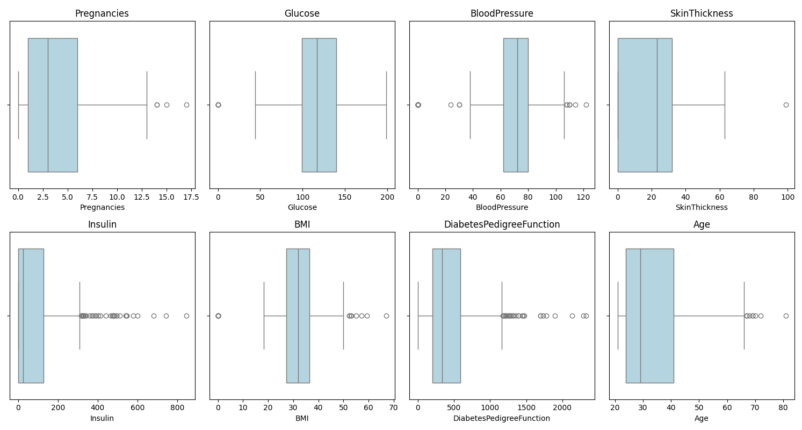

O que eu pude entender desse método é que ele calcula inicialmente a mediana dos valores, depois disso divide em outros dois valores Q1 e Q3, o Q1 é um valor onde 25% da amostra é menor que ele, enquanto o Q3, 75% dos valores da amostra são menores que eles, com base nisso calculamos uma relação entre a mediana, o Q1 e Q3, os valores que se distoam dessa relação são os possíveis *outliners*

# Questão 2

Para respresentar os histogramas e os boxplots, utilizaremos a biblioteca seaborn, para pegarmos os histogramas de cada uma das colunas utilizaremos esse algoritmo

``` python

import pandas as pd
import numpy as np
import matplotlib.pyplot as plt
import seaborn as sns

# Carregar o dataset
df = pd.read_csv("diabetes.csv")

## Excluindo coluna outcome
col = df.columns[:-1]

## Histogramas
plt.figure(figsize=(16, 10))
for i, col in enumerate(df.columns[:-1], 1):
    plt.subplot(3, 3, i)
    sns.histplot(df[col], bins=30, kde=True, color='lightblue')
    plt.title(f'{col}')
plt.tight_layout()
plt.show()

```

com isso obtemos esse resultado:

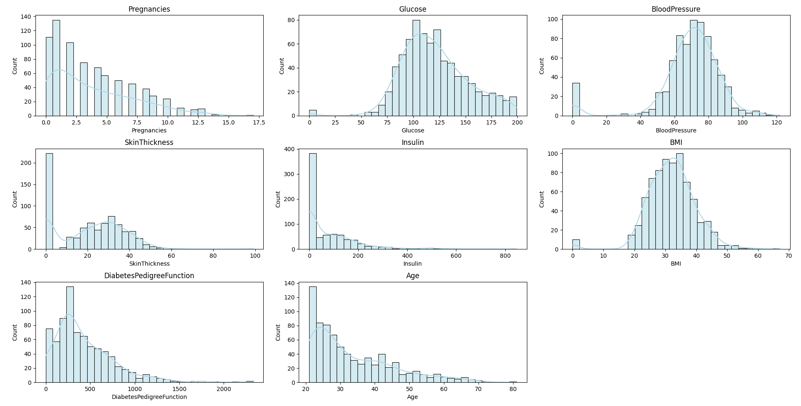

Para pegarmos os boxplots vamos usar o mesmo algoritmo da questão passada

``` python

'''
2. Como as principais variáveis (Glucose, BloodPressure, BMI, etc.) estão
distribuídas? Utilize histogramas e boxplots para representar visualmente essas
distribuições e analise as características de cada uma.
'''

import pandas as pd
import numpy as np
import matplotlib.pyplot as plt
import seaborn as sns

# Carregar o dataset
df = pd.read_csv("diabetes.csv")

## Excluindo coluna outcome
col = df.columns[:-1]

## Histogramas
plt.figure(figsize=(16, 10))
for i, col in enumerate(df.columns[:-1], 1):
    plt.subplot(3, 3, i)
    sns.histplot(df[col], bins=30, kde=True, color='lightblue')
    plt.title(f'{col}')
plt.tight_layout()
plt.show()

## Boxplots
plt.figure(figsize=(16, 10))
for i, col in enumerate(df.columns[:-1], 1):
    plt.subplot(3, 3, i)
    sns.boxplot(x=df[col], color='lightblue')
    plt.title(f'{col}')
plt.tight_layout()
plt.show()
```

Como resultado:


- **Pregnancies**: Assimétrica à direita, com valores extremos acima de 10 gestações sendo outliers raros, mas possíveis.
- **Glucose**: Distribuição aproximadamente normal, mas com um pequeno pico entre 100–125. Apresenta valores 0 que foram tratados anteriormente.
- **BloodPressure**: Levemente assimétrica para a esquerda, com vários valores 0 (inválidos).
- **SkinThickness** e **Insulin**: Distribuições altamente assimétricas, com muitos zeros e diversos outliers. Isso indica que essas variáveis possuem muitos valores faltantes e dispersos.
- **BMI**: Levemente assimétrica à direita. Também apresenta outliers leves.
- **DiabetesPedigreeFunction**: Distribuição altamente assimétrica, com muitos valores baixos (0.1 a 0.4) e poucos casos muito altos.
- **Age**: Tendência clara à direita, com maioria entre 20 e 40 anos, mas alguns pacientes com mais de 70.

# Questão 3

O boxplot mostra que pacientes com `Outcome = 1` tendem a ter uma **distribuição de idade mais elevada**.

``` python

'''
3. Existe uma correlação entre a idade dos indivíduos e a presença de diabetes?
Realize uma análise estatística (como teste de correlação) e utilize gráficos (como
scatter plot ou boxplot) para ilustrar essa relação.
'''

import pandas as pd
import numpy as np
import matplotlib.pyplot as plt
import seaborn as sns

# Carregar o dataset
df = pd.read_csv("diabetes.csv")

## Verificando semelhança entre Idade e Diabetes
sns.boxplot(x='Outcome', y='Age', data=df, palette='Set2')
plt.title('Boxplot de Idade por Diabetes')
plt.xlabel('Diabetes (0 = Não, 1 = Sim)')
plt.ylabel('Idade')
plt.grid(True)
plt.show()
```

Temos como resultado:

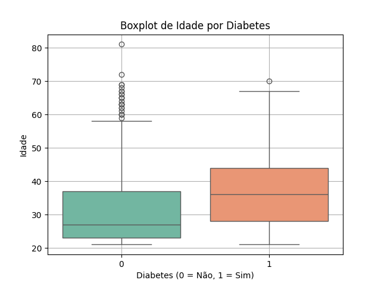

# Questão 4

Para descobrirmos quais variáveis possuem uma correlação maior a ter diabetes, vamos criar um gráfico de heatmap e ordernar os valores, utilizando esse algoritmo:

``` python
'''
4. Quais variáveis apresentam maior correlação com a presença de diabetes? Quais
variáveis parecem ser as mais indicativas da presença de diabetes?
'''

import pandas as pd
import numpy as np
import matplotlib.pyplot as plt
import seaborn as sns

# Carregar o dataset
df = pd.read_csv("diabetes.csv")

## Verificando correlação entre variáveis
corr = df.corr()

## plotando um heatmap
plt.figure(figsize=(12, 8))
sns.heatmap(corr, annot=True, cmap='coolwarm', fmt='.2f', linewidths=0.5, square=True)
plt.title('Correlação entre variáveis')
plt.show()

## mostra as variáveis mais indicativas da presença de diabetes
print("Variáveis mais indicativas da presença de diabetes:")
correlacao_diabetes = corr['Outcome'].sort_values(ascending=False)
print(correlacao_diabetes)
```

Dessa forma temos esse resultado:

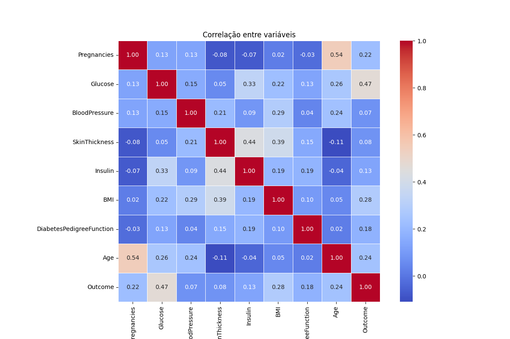

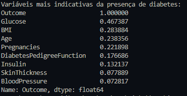

as variáveis mais relevantes para modelos preditivos de diabetes são `Glucose`, `BMI`, `Age` e `Pregnancies`.

# Questão 5

Ao analisar entre IMC de quem possui diabetes e quem não possui, demonstra uma certa tendência. Para fazer essa análise, foi utilizado o seguinte algoritmo:

``` python

'''
5. Existe uma relação entre o IMC dos pacientes e o diagnóstico de diabetes?
Compare os valores médios de IMC entre os grupos com e sem diabetes, e
analise a diferença estatisticamente.

'''

import pandas as pd
import numpy as np 
import matplotlib.pyplot as plt
import seaborn as sns

# Carregar o dataset
df = pd.read_csv("diabetes.csv")

## Ver médias de IMC entre os grupos com e sem diabetes
imc_diabetes = df.groupby('Outcome')['BMI'].mean()
print("Média de IMC por Diabetes:")
print(imc_diabetes)
print("\nDiferença de IMC entre os grupos:")
print(imc_diabetes[1] - imc_diabetes[0])

## Boxplot
sns.boxplot(x='Outcome', y='BMI', data=df, palette='Set2')
plt.title('Boxplot de IMC por Diabetes')
plt.xlabel('Diabetes (0 = Não, 1 = Sim)')
plt.ylabel('IMC')
plt.grid(True)
plt.show()
```

Obtendo Assim os seguintes resultados:

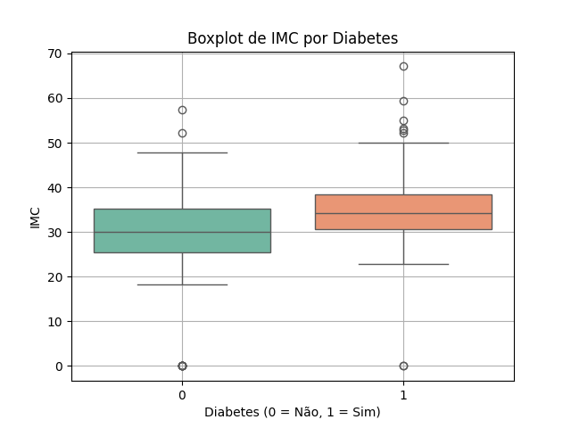

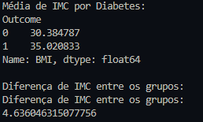

existe uma **relação positiva** entre o IMC e o diagnóstico de diabetes. Isso faz sentido clínico, pois o sobrepeso é um conhecido fator de risco para o desenvolvimento da doença.

# Questão 6

Para responder essa pergunta, primeiramente precisamos ver qual a relação da glicose entre os grupos que possuem diabetes e os que não possuem, para isso utilizaremos o mesmo algoritmos de boxplot utilizado nas demais questões

``` python
import pandas as pd
import numpy as np 
import matplotlib.pyplot as plt
import seaborn as sns
from sklearn.metrics import accuracy_score

# Carregar o dataset
df = pd.read_csv("diabetes.csv")

## Boxplot de glicose por grupo
sns.boxplot(x='Outcome', y='Glucose', data=df, palette='Set2')
plt.title('Boxplot de Glicose por Diabetes')
plt.xlabel('Diabetes (0 = Não, 1 = Sim)')
plt.ylabel('Glucose')
plt.grid(True)
plt.show()
```

Com isso temos esse resultado:

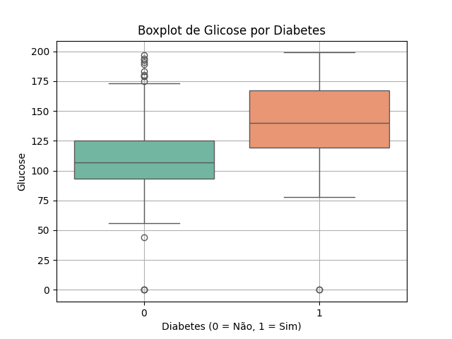

Segundo o gráfico boxplot pessoas que possuem diabetes, tendem a ter o nível de glicose mais alto, para melhor análisa, utilizei um gráfico de densidade

``` python
import pandas as pd
import numpy as np 
import matplotlib.pyplot as plt
import seaborn as sns
from sklearn.metrics import accuracy_score

# Carregar o dataset
df = pd.read_csv("diabetes.csv")

## Boxplot de glicose por grupo
sns.boxplot(x='Outcome', y='Glucose', data=df, palette='Set2')
plt.title('Boxplot de Glicose por Diabetes')
plt.xlabel('Diabetes (0 = Não, 1 = Sim)')
plt.ylabel('Glucose')
plt.grid(True)
plt.show()

## Criando gráfico de densidade
sns.kdeplot(df[df['Outcome'] == 0]['Glucose'], label='Sem Diabetes', color='blue')
sns.kdeplot(df[df['Outcome'] == 1]['Glucose'], label='Com Diabetes', color='red')
plt.title('Distribuição de Glicose por Diabetes')
plt.xlabel('Glicose')
plt.ylabel('Densidade')
plt.legend()
plt.grid(True)
plt.show()

## Médias de glicose por grupo
print("Média de Glicose por Diabetes:")
print(df.groupby('Outcome')['Glucose'].mean())
print("\nDiferença de Glicose entre os grupos:")
print(df.groupby('Outcome')['Glucose'].mean()[1] - df.groupby('Outcome')['Glucose'].mean()[0])
```

Como resultado temos:

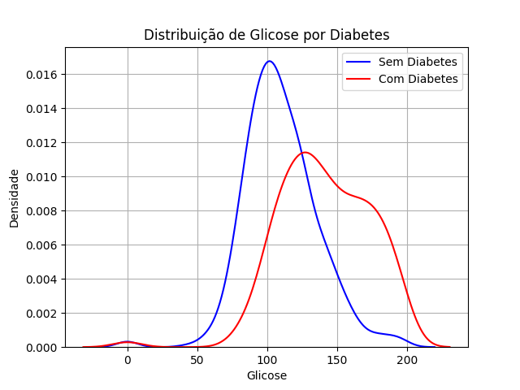

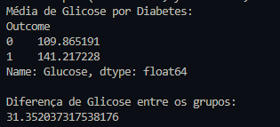

Testando diferentes limiares de glicose como classificadores simples, e observamos que o ponto de corte ideal fica em torno de **125–130 mg/dL**, com acurácia razoável (>70%)

``` python

'''
6. Existe um valor específico de glicose que pode ser considerado crítico para o
diagnóstico de diabetes? Utilize gráficos de dispersão e cálculos estatísticos para
investigar esse ponto e definir um limite crítico, se possível.

'''

import pandas as pd
import numpy as np 
import matplotlib.pyplot as plt
import seaborn as sns
from sklearn.metrics import accuracy_score

# Carregar o dataset
df = pd.read_csv("diabetes.csv")

## Boxplot de glicose por grupo
sns.boxplot(x='Outcome', y='Glucose', data=df, palette='Set2')
plt.title('Boxplot de Glicose por Diabetes')
plt.xlabel('Diabetes (0 = Não, 1 = Sim)')
plt.ylabel('Glucose')
plt.grid(True)
plt.show()

## Criando gráfico de densidade
sns.kdeplot(df[df['Outcome'] == 0]['Glucose'], label='Sem Diabetes', color='blue')
sns.kdeplot(df[df['Outcome'] == 1]['Glucose'], label='Com Diabetes', color='red')
plt.title('Distribuição de Glicose por Diabetes')
plt.xlabel('Glicose')
plt.ylabel('Densidade')
plt.legend()
plt.grid(True)
plt.show()

## Médias de glicose por grupo
print("Média de Glicose por Diabetes:")
print(df.groupby('Outcome')['Glucose'].mean())
print("\nDiferença de Glicose entre os grupos:")
print(df.groupby('Outcome')['Glucose'].mean()[1] - df.groupby('Outcome')['Glucose'].mean()[0])

## Criar um limiar crítico
for limite in range(100 ,170,5):
    y_pred_limite = df['Glucose'].apply(lambda x: 1 if x >= limite else 0)
    acc = accuracy_score(df['Outcome'], y_pred_limite)
    print(f"Limiar: {limite}, Acurácia: {acc:.5f}")
```

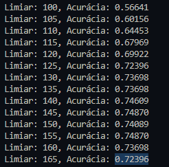

Como conclusão temos:

- **A média de glicose entre os pacientes com diabetes foi significativamente maior do que entre os sem diabetes.**
- valores de glicose acima de **125 mg/dL** podem ser considerados **críticos para o diagnóstico de diabetes**, servindo como um bom indicador de risco.

# Questão 7

Para treinar um modelo de árvore de decisão, foi utilizado um modelo da biblioteca do sklearn, para isso, os algoritmo foi disposto da seguinte forma:

``` python
'''
7. Treine um modelo de árvore de decisão para prever a presença de diabetes com
base nas variáveis do dataset. Qual foi a acurácia obtida? Discuta os resultados e
possíveis melhorias para o modelo.
'''

import pandas as pd
import numpy as np 
import matplotlib.pyplot as plt
import seaborn as sns
from sklearn.model_selection import train_test_split
from sklearn.metrics import accuracy_score, confusion_matrix, classification_report
from sklearn.tree import plot_tree
from sklearn.tree import DecisionTreeClassifier


# Carregar o dataset
df = pd.read_csv("diabetes.csv")

## Separando as variáveis independentes (X) e dependentes (y)
X = df.drop('Outcome', axis=1)
y = df['Outcome']

## Dividir o dataset em conjunto de treino e teste (80/20)
X_train, X_test, y_train, y_test = train_test_split(X, y, test_size=0.2, random_state=42)

## Criar e treinar o modelo
model = DecisionTreeClassifier(random_state=42)
model.fit(X_train, y_train)

## Previsões
y_pred = model.predict(X_test)

## Avaliar o modelo
accuracy = accuracy_score(y_test, y_pred)
print(f"Acurácia do modelo: {accuracy:.2f}")

print("\nMatriz de Confusão:")
print(confusion_matrix(y_test, y_pred))

print("\nRelatório de Classificação:")
print(classification_report(y_test, y_pred))


## Visualizar a árvore de decisão
plt.figure(figsize=(20,10))
plot_tree(model, filled=True, feature_names=X.columns, class_names=['Não Diabetes', 'Diabetes'])
plt.title('Árvore de Decisão para Previsão de Diabetes')
plt.show()
```

Obtendo então os seguintes resultados:

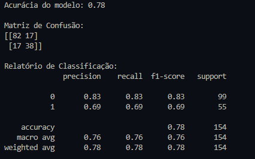

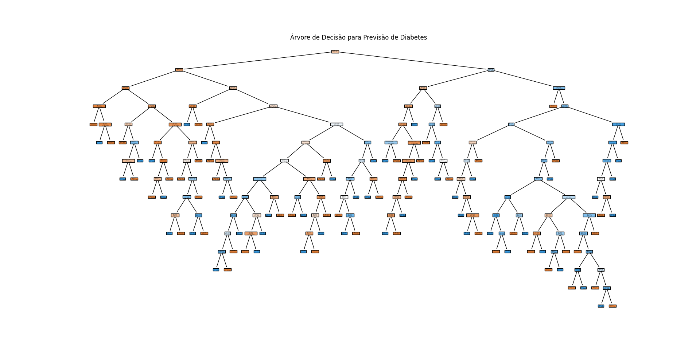

**Resultados (segundo matriz de  confusão):**

- **Acurácia**: 78%
- **Matriz de Confusão**:
    - Verdadeiros negativos: 82
    - Falsos positivos: 17
    - Falsos negativos: 17
    - Verdadeiros positivos: 38

**Relatório de Classificação:**

- **Classe 0 (sem diabetes)**: precision = 0.83, recall = 0.83, f1 = 0.83
- **Classe 1 (com diabetes)**: precision = 0.69, recall = 0.69, f1 = 0.69

Como conclusão, podemos dizer que o modelo apresenta uma boa precisão.

# Questão 8

Para responder essa pergunta, criaremos então um boxplot comparando o grupo com uma probabilidade de predisposição à diabetes, depois vamos comparar as médias com o grupo que possui e com o grupo que não possui. Durante a solução foi identificado que os dados não estavam normalizados, então o algoritmo a seguir normaliza e retorna a diferença entre os grupos:

``` python

'''
8. A variável DiabetesPedigreeFunction está relacionada à presença de diabetes?
Pacientes com histórico familiar de diabetes apresentam maior risco? Realize
uma análise exploratória e estatística para verificar essa relação.
'''

import pandas as pd
import numpy as np 
import matplotlib.pyplot as plt
import seaborn as sns

# Carregar o dataset
df = pd.read_csv("diabetes.csv")


# print(df['DiabetesPedigreeFunction'].dtype)
# print(df['DiabetesPedigreeFunction'].head())

## normalizar os valores de DiabetesPedigreeFunction
df['DiabetesPedigreeFunction'] = df['DiabetesPedigreeFunction'] / 1000
df['DiabetesPedigreeFunction'].describe()

## Boxplot de DiabetesPedigreeFunction por grupo
sns.boxplot(x='Outcome', y='DiabetesPedigreeFunction', data=df, palette='Set2')
plt.title('Boxplot de DiabetesPedigreeFunction por Diabetes')
plt.xlabel('Diabetes (0 = Não, 1 = Sim)')
plt.ylabel('DiabetesPedigreeFunction')
plt.grid(True)
plt.show()

## Comparando as médias de DiabetesPedigreeFunction entre os grupos
print("Média de DiabetesPedigreeFunction por Diabetes:")
print(df.groupby('Outcome')['DiabetesPedigreeFunction'].mean())
print("\nDiferença de DiabetesPedigreeFunction entre os grupos:")
print(df.groupby('Outcome')['DiabetesPedigreeFunction'].mean()[1] - df.groupby('Outcome')['DiabetesPedigreeFunction'].mean()[0])
```

Como resultado obtemos:

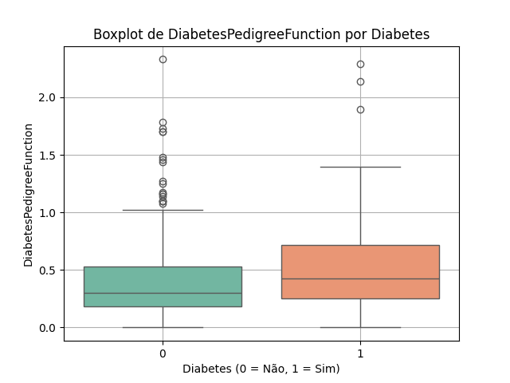

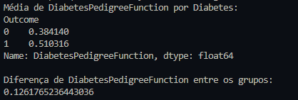

Com base nos dados, podemos obervar que: 
- Pacientes **sem diabetes (Outcome = 0)** têm média de **0.384**
- Pacientes **com diabetes (Outcome = 1)** têm média de **0.510**
- A diferença média entre os grupos é de aproximadamente **0.126**

Existe uma diferença positiva em quem possui um histórico familiar de diabetes, o que reforça na probabilidade da doença.

# Questão 9

Realização o agrupamento por idades e comparando as taxas de diabates, partimos da premissa de que grupos mais velhos possuem uma tendência maior a diabete, para analisarmos isso será criado um gráfico de barras e comparar a taxa entre os dois grupos etários

``` python

'''
9. Pacientes com mais de 50 anos têm taxas de diabetes mais altas do que
pacientes mais jovens? Utilize estatísticas descritivas e gráficos comparativos
para demonstrar as diferenças entre esses dois grupos etários.
'''

import pandas as pd
import numpy as np 
import matplotlib.pyplot as plt
import seaborn as sns

# Carregar o dataset
df = pd.read_csv("diabetes.csv")

## Criar um grupo de pacientes com mais de 50 anos
df['AgeGroup'] = df['Age'].apply(lambda x: 'Mais de 50' if x > 50 else 'Menos de 50')

## Taxa de diabetes por grupo etário
df['DiabetesRate'] = df.groupby('AgeGroup')['Outcome'].transform(lambda x: x.mean())

print("Taxa de diabetes por grupo etário:")
print(df.groupby('AgeGroup')['DiabetesRate'].mean())

## Gráfico de barras comparando as taxas de diabetes entre os grupos etários
sns.barplot(x='AgeGroup', y='DiabetesRate', data=df, palette='Set2')
plt.title('Taxa de Diabetes por Grupo Etário')
plt.xlabel('Grupo Etário')
plt.ylabel('Taxa de Diabetes')
plt.grid(True)
plt.show()
```

Como resultado temos:

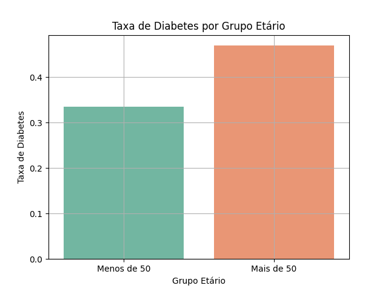


A taxa de diagnóstico de diabetes foi:

- **Mais de 50 anos**: **46.91%**
- **Menos de 50 anos**: **33.47%**

Pacientes com a idade >= 50 anos possuem uma probabilidade maior de prevalência de diabetes.

# questão 10

Para realizar esse treino de regressão logística, foi utilizado um modelo da biblioteca do sklearn, como o `LogisticRegression` não aceita valores Nan, então para remover as nulidades foi utilizado o método citado na questão 1 de trocar os valores nulos pela mediana da respectiva coluna, não enviesando assim os dados

``` python

'''
10. Utilize regressão logística para estimar a probabilidade de um paciente ser
diagnosticado com diabetes. Quais variáveis são mais influentes no modelo e
como elas impactam a probabilidade de diagnóstico?
'''

import pandas as pd
import numpy as np
import matplotlib.pyplot as plt
import seaborn as sns
from sklearn.model_selection import train_test_split
from sklearn.linear_model import LogisticRegression
from sklearn.metrics import accuracy_score, confusion_matrix, classification_report


# Carregar o dataset
df = pd.read_csv("diabetes.csv")

## dividir o dataset em variáveis independentes (X) e dependentes (y)
X = df.drop('Outcome', axis=1)
y = df['Outcome']

## removendo valores nulos [substituindo pela média]
X = X.fillna(X.median())

X_train, X_test, y_train, y_test = train_test_split(X, y, test_size=0.2, random_state=42)

## Treinando o modelo
model = LogisticRegression(max_iter=1000)
model.fit(X_train, y_train)

y_pred = model.predict(X_test)

## Avaliar o modelo
accuracy = accuracy_score(y_test, y_pred)
print(f"Acurácia do modelo: {accuracy:.2f}")

## Matriz de Confusão
print("\nMatriz de Confusão:")
print(confusion_matrix(y_test, y_pred))

## Relatório de Classificação
print("\nRelatório de Classificação:")
print(classification_report(y_test, y_pred))

## Interpretação dos coeficientes
print("\nCoeficientes do modelo:")
print(model.coef_)
print("\nIntercepto do modelo:")
print(model.intercept_)
```

Dessa forma obtemos o seguinte resultado:

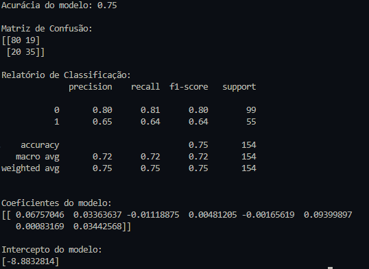

Como conclusão, temos:

**Acurácia obtida**: **75%**

**Matriz de Confusão:**
- Pacientes sem diabetes (classe 0): 80 acertos, 19 erros
- Pacientes com diabetes (classe 1): 35 acertos, 20 erros

**Métricas por classe:**

| Classe | Precision | Recall | F1-Score |
|--------|-----------|--------|----------|
| 0 (sem diabetes) | 0.80 | 0.81 | 0.80 |
| 1 (com diabetes) | 0.65 | 0.64 | 0.64 |

**Principais variáveis influentes (positivos):**

- `BMI`: quanto maior o IMC, maior a chance de diabetes
- `Age`: pacientes mais velhos têm risco maior
- `Glucose`: mais glicose → maior probabilidade de diabetes

# Questão 11

Uma ideia seria combinar algumas features para analisar a dependência de cada uma em relação a chance de diabetes, uma possível ideia seria combinar a idade do paciente junto com o seu IMC, agrupando de forma que consigamos analisar qual a influência de pacientes com sobrepeso e idade mais avançada afeta no risco de diabetes, temos então que:

- **BMI_Age** = `BMI` × `Age`

```python

'''
11. Quais técnicas de feature engineering podem ser aplicadas para melhorar a
previsão do diagnóstico de diabetes utilizando modelos de aprendizado de
máquina? Experimente transformar variáveis existentes, criar novas variáveis a
partir de combinações ou interações e utilize técnicas como encoding,
normalização ou transformação de características. Avalie o impacto dessas
mudanças no desempenho de um modelo de aprendizado de máquina (por
exemplo, Random Forest ou XGBoost).
'''

import pandas as pd
import numpy as np
import matplotlib.pyplot as plt
import seaborn as sns
from sklearn.model_selection import train_test_split
from sklearn.ensemble import RandomForestClassifier
from sklearn.metrics import accuracy_score, confusion_matrix, classification_report

# Load the dataset
df = pd.read_csv("diabetes.csv")

## Criar uma nova variável de IMC (Índice de Massa Corporal) por idade
df['BMI_Age'] = df['BMI'] * df['Age']

## Separar as variáveis independentes (X) e dependentes (y)
X = df.drop('Outcome', axis=1)
y = df['Outcome']

## Verificar se há valores nulos e substitui-los pela média
X = X.fillna(X.median())

## Treinar modelo com random forest
X_train, X_test, y_train, y_test = train_test_split(X, y, test_size=0.2, random_state=42)

model = RandomForestClassifier(random_state=42)
model.fit(X_train, y_train)

## Previsões
y_pred = model.predict(X_test)

## Avaliar o modelo
accuracy = accuracy_score(y_test, y_pred)
print(f"Acurácia do modelo: {accuracy:.2f}")

## Matriz de Confusão
print("\nMatriz de Confusão:")
print(confusion_matrix(y_test, y_pred))

## Relatório de Classificação
print("\nRelatório de Classificação:")
print(classification_report(y_test, y_pred))

## Importancia das variáveis em um gráfico
importances = model.feature_importances_
indices = np.argsort(importances)[::-1]
features = X.columns[indices]
importances = importances[indices]
plt.figure(figsize=(12, 6))
plt.title("Importância das Variáveis")
plt.bar(range(X.shape[1]), importances, align="center")
plt.xticks(range(X.shape[1]), features, rotation=90)
plt.xlim([-1, X.shape[1]])
plt.show()
```

O modelo com essa nova feature foi treinada com uma Random Forest, de forma que:

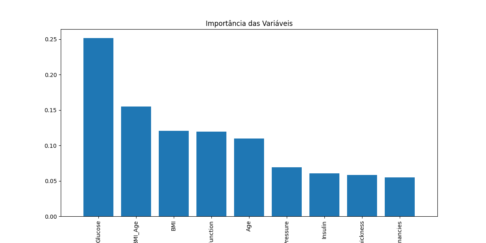

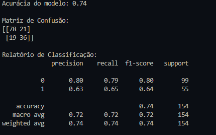


- **Acurácia**: 74%
- **Precision (classe 1)**: 63%
- **Recall (classe 1)**: 65%
- **F1-score (classe 1)**: 64%

A performance foi semelhante à da regressão logística, mostrando que o modelo se manteve estável mesmo com a adição de novas variáveis, o que indica que os dados são consistentes.

Dessa forma, essa nova feature se mostra com um grande potencial a ser analisado, contribuindo para uma melhor análise dos dados e treinamento de modelos.