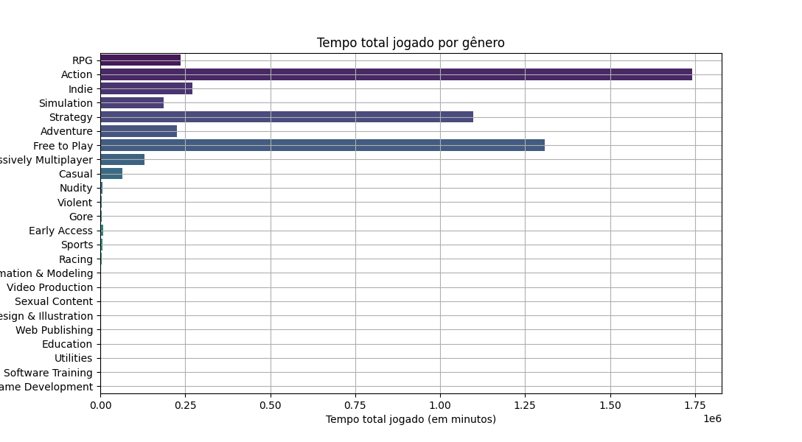
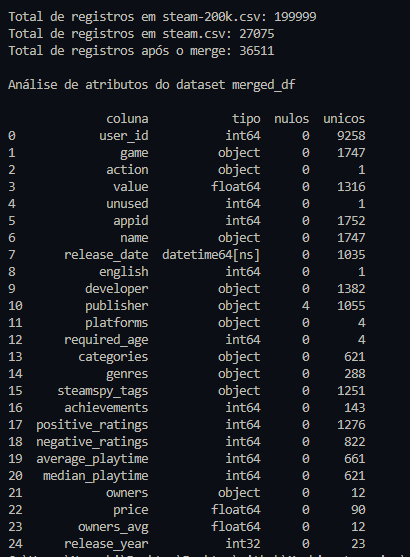
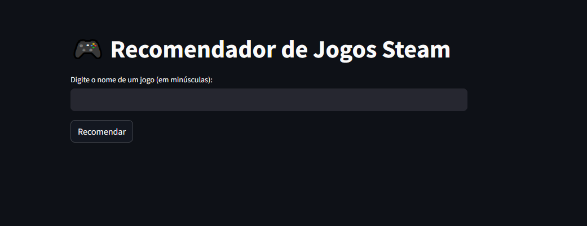
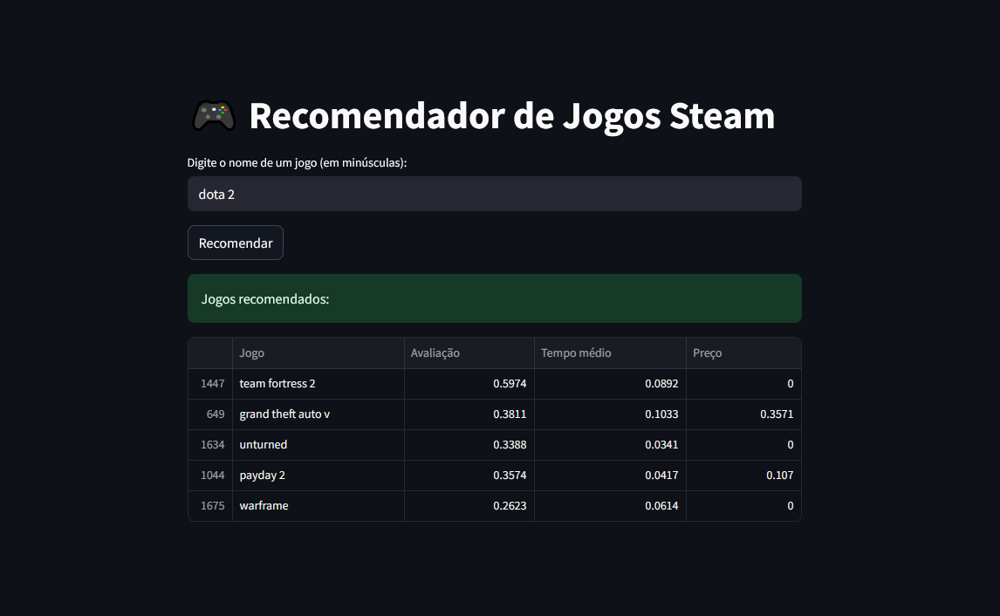

# Sistema de Recomendação de Jogos - Steam

Projeto de análise exploratória e construção de um sistema de recomendação de jogos baseado em conteúdo, utilizando dados da plataforma Steam.

---

## Estrutura do Projeto

- **`project.py`**: Análise exploratória dos dados, pré-processamento e criação do sistema de recomendação.
- **`app.py`**: Interface Web utilizando Streamlit para realizar recomendações.
- **`data/`**: Diretório contendo:
  - `steam.csv`: Catálogo de jogos.
  - `steam-200k.csv`: Interações de usuários.
- **`img/`**: Diretório com imagens geradas durante a análise exploratória.

---

## Tecnologias Utilizadas

- Python 3.11+
- Pandas
- NumPy
- Matplotlib
- Seaborn
- Scikit-Learn
- Streamlit

---

## Análise Exploratória dos Dados

### Dataset: `steam.csv` (Catálogo de Jogos)

Analisamos 18 colunas principais, com destaque para:

- `appid`, `name`: Identificação do jogo.
- `release_date`: Convertido para `datetime`, extraído o `release_year`.
- `english`, `required_age`: Variáveis discretas.
- `developer`, `publisher`, `platforms`, `categories`, `genres`, `steamspy_tags`: Variáveis categóricas importantes para recomendação.
- `positive_ratings`, `negative_ratings`, `average_playtime`, `price`, `owners`: Variáveis numéricas, normalizadas para análise.

**Tratamentos importantes**:
- Faixa de donos (`owners`) convertida para média (`owners_avg`).
- Preços e avaliações normalizados.
- Explosão de múltiplos gêneros.

---

### Dataset: `steam-200k.csv` (Interações de Usuários)

Colunas principais:

- `user_id`: Identificador anônimo.
- `game`: Nome do jogo.
- `action`: Tipo de ação (`play` ou `purchase`).
- `value`: Tempo jogado (minutos).

**Filtro aplicado**: Analisamos apenas interações do tipo `play`, descartando compras (`purchase`).

---

## Visualizações e Análises

### 1. Matriz de Correlação (`steam.csv`)

**Análise**:
- Correlação forte entre `positive_ratings` e `negative_ratings` (0.76).
- `average_playtime` tem correlação fraca (~0.16) com avaliações.
- `price` não apresenta correlação relevante, indicando que preço não é determinante para avaliação ou tempo de jogo.

---

### 2. Top 10 Jogos Mais Jogados (`steam-200k.csv`)

**Análise**:
- Jogos gratuitos e multiplayer dominam (ex: **Dota 2**, **Counter-Strike**).
- Alto tempo jogado associado a jogos competitivos ou massivos online.
- Tendência de viés por popularidade.

---

### 3. Distribuição de Jogos por Usuário

**Análise**:
- A maioria dos usuários jogou poucos jogos (1 a 5).
- Pequena parcela de "usuários pesados" jogaram centenas de jogos.
- Dados esparsos comuns em bases de recomendação.

---

### 4. Distribuição do Tempo Jogando

**Análise**:
- Predominância de usuários com pouco tempo jogado.
- Existência de outliers (usuários com milhares de horas).
- Necessidade de normalização dos tempos para modelagem.

---

### 5. Tempo Total Jogado por Gênero

**Análise**:
- Gêneros **Action**, **Strategy**, **Free to Play** são os mais jogados.
- Gêneros mais nichados como **Racing**, **Education** apresentam baixa adesão.

---

## Transformações de Dados

Transformações aplicadas nos datasets:

| Transformação | Descrição |
| :--- | :--- |
| `owners` ➔ `owners_avg` | Média da faixa de donos para variável contínua |
| `release_date` ➔ `release_year` | Extração do ano |
| `genres` ➔ One-Hot Encoding | Codificação para machine learning |
| Normalização | Variáveis numéricas normalizadas entre 0 e 1 (`MinMaxScaler`) |
| Filtro `action == 'play'` | Consideramos apenas ações de jogo real |
| Remoção de outliers | Jogos com tempos extremos de mais de 10.000 minutos filtrados |

---

## Sistema de Recomendação Baseado em Conteúdo

**Lógica**:

- Construção de vetores de atributos de cada jogo.
- Similaridade calculada via **Cosine Similarity**.
- Sugestão de jogos semelhantes com base nas features normalizadas.

---

## Aplicação Web com Streamlit

### Tela Inicial:

Interface simples para digitar o nome de um jogo.

---

### Exemplo de Recomendação ("dota 2"):

- São exibidos os 5 jogos mais similares ao digitado.
- Métricas mostradas: Avaliação, Tempo médio de jogo e Preço.

