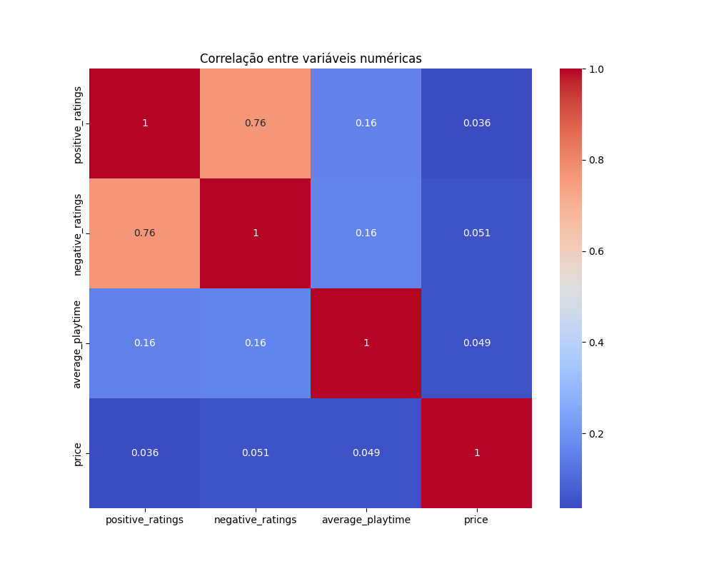
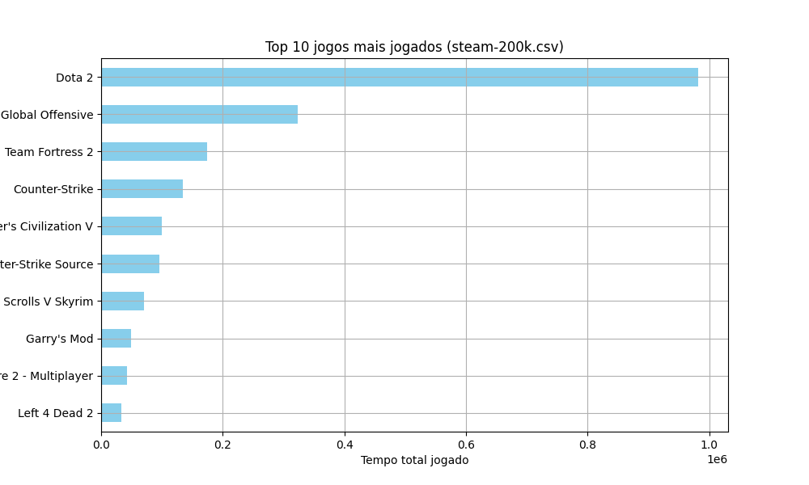
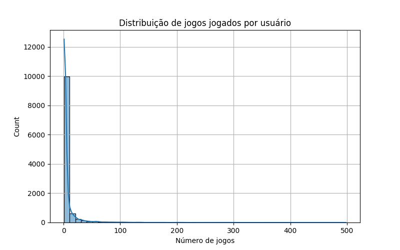
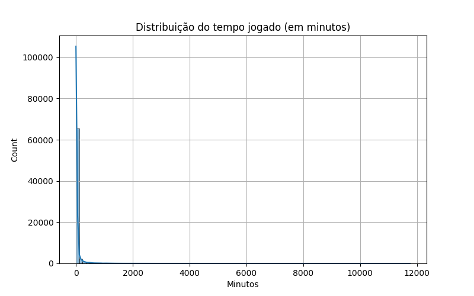

# Análise Exploratória dos Dados – Sistema de Recomendação Steam

## 1. Análise Detalhada de Cada Atributo

### Dataset: `steam.csv` (Catálogo de Jogos)

Realizamos uma análise das 18 colunas disponíveis. Abaixo estão os principais destaques:

- `appid`: Identificador único do jogo. Não será usado como entrada no modelo.
- `name`: Nome do jogo. Útil apenas para visualização de resultados.
- `release_date`: 2.619 valores ausentes (~10%). Transformada em `datetime` e posteriormente em `release_year`.
- `english`, `required_age`: Colunas numéricas discretas. Sem valores ausentes. Podem ser utilizadas como filtros.
- `developer`, `publisher`, `platforms`, `categories`, `genres`, `steamspy_tags`: Atributos categóricos e textuais. Relevantes para recomendação baseada em conteúdo. Necessitam transformação.
- `positive_ratings`, `negative_ratings`: Avaliações dos usuários. Sem valores ausentes e com boa variabilidade.
- `average_playtime`, `median_playtime`: Tempo médio e mediano de jogo. Importantes para medir engajamento.
- `owners`: Faixa textual convertida para média numérica com `owners_avg`.
- `price`: Preço dos jogos. Alguns jogos possuem preço 0 (gratuitos).

### Dataset: `steam-200k.csv` (Interações de Usuários)

Colunas:
- `user_id`: Identificação anônima do usuário (12.399 únicos).
- `game`: Nome do jogo (5.155 únicos).
- `action`: Dois tipos principais: `play` (tempo jogado) e `purchase` (compra).
- `value`: Tempo jogado em minutos (ou valor da compra, dependendo da ação).
- `unused`: Coluna irrelevante. Ignorada.

> A ação mais frequente é `play`, o que justifica o foco apenas nos registros de jogo real.

---

## 2. Visualização e Correlação dos Dados

### Matriz de Correlação (`steam.csv`)

- `positive_ratings` e `negative_ratings` possuem correlação forte (0.76), sugerindo que jogos populares atraem tanto elogios quanto críticas.
- `average_playtime` tem correlação moderada com ambas as avaliações (~0.16).
- `price` não possui correlação significativa com nenhuma variável (<0.05), o que sugere que o preço não é um fator decisivo para avaliação ou tempo de jogo.

### Top 10 Jogos Mais Jogados (`steam-200k.csv`)

- Jogos gratuitos e multiplayer como **Dota 2** e **CS:GO** dominam o tempo total jogado.
- Isso pode introduzir viés no sistema de recomendação, já que popularidade extrema tende a ofuscar jogos menos jogados, porém relevantes.

### Distribuição de Jogos por Usuário

- A maioria dos usuários joga poucos jogos (1 a 5).
- Poucos usuários jogam mais de 50 jogos.
- Isso indica que usuários com muitos jogos fornecem mais dados, enquanto a maioria tem dados escassos (problema comum em filtragem colaborativa).

### Distribuição de Tempo de Jogo

- A maior parte dos jogos tem tempo de jogo muito baixo (pico abaixo de 100 minutos).
- Há outliers com milhares de horas, que devem ser tratados com normalização ou limiar.

---

## 3. Identificação de Transformações Potenciais

### Transformações realizadas:

- `owners` → `owners_avg`: Média da faixa de donos convertida para número.
- `average_playtime` → `playtime_norm`: Normalização para valores entre 0 e 1.
- `release_date` → `release_year`: Extração do ano de lançamento.
- `action == 'play'`: Filtragem da base para considerar apenas ações de jogo real.
- (Em andamento) Codificação de `genres`, `tags` e `categories` para uso em recomendação baseada em conteúdo (`get_dummies` ou `TF-IDF`).

---

## Conclusões

- A base de dados dos jogos (`steam.csv`) apresenta atributos altamente relevantes para sistemas de recomendação baseados em conteúdo.
- A base de interações (`steam-200k.csv`) permite modelar o comportamento do usuário, essencial para sistemas colaborativos.
- As análises sugerem a necessidade de normalização e possível tratamento de outliers.
- A presença de atributos textuais e temporais permite enriquecimento com **engenharia de features** futuras.
- Com essas bases combinadas, é possível criar um sistema de recomendação híbrido (conteúdo + colaborativo).

